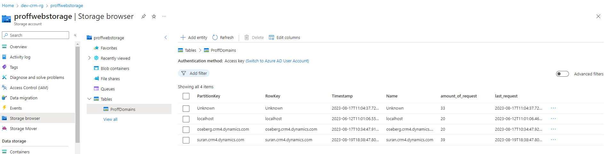

Løsningen er under utvikling og nyeste versjon vill alltid ligge på Suran.crm4 miljøet da det er det aktive endepunktet for React-PCF komponentet.

PCF Komponentet er et Virtual Control, utvikelt med React Typscript og Fluent UI.

Vi bruker REST API tjenesten til Proff for å query data, men Proff tilatter ikke direkte kommunikasjon mellom nettleser og deres webtjenester, så vi opprettet en .NET Azure Function som en Proxy server som fungerer da som et mellomledd for data flyten.

Alle spørringer og responser går gjennom denne Azure Function applikasjonen. Se gjerne på flowchart visualiseringen under for en mer detaljert og visuell beskrivelse av løsningensflyten.

Flowchart av løsningen:

Som vi ser på flowcharten, så gjør vi en ny spørring når vi først klikker på et kort for å hente ytterlig informasjon for det selskapet. Dette er for å spare API spørringer da, det er ulike endepunkter for å hente info som numberOfEmployees og NACE. Vi henter disse dataene da når brukeren først bestemmer seg for en kunde og klikker på en.

Felter vi ber om fra proff (ikke sikkert alle felt har verdi):

Basic subscription (active subscription):

- Name
- ProffCompanyId
- CompanyTypeName
- NumberOfEmployees
- OrganisationNumber
- Email
- HomePage
- MobilePhone
- TelephoneNumber
- AddressLine
- BoxAddressLine
- PostPlace
- ZipCode
- VisitorAddressLine
- VisitorBoxAddressLine
- VisitorPostPlace
- VisitorZipCode

* Med Premium:

- Profit
- Revenue
- Likviditetsgrad
- TotalrentabilitetLoennsomhet
- Egenkapitalandel

Vi må huske å mappe disse feltene riktig når vi setter opp PCF Komponentet:
Gå til Løsningen:

Velg da Tabeller -> Så forretningsforbindelse -> Skjema så klikk å Hovedskjema:

Når vi er inne på skjema, dobbelklikk på Søke feltet, velg så Komponenter for å utvide for å se flere valg i Egeneskaper. Klikk så på VirtualControl:

Når vi har klikket på VirtualControl, så får vi opp et vindu som viser alle feltene vi henter, og disse kan vi nå mappe til felter i Forretningsforbindelse felter:

I koden så har jeg allerede spesifisert de "Standard" feltene, og disse vil da automatisk bli feltet, men når det gjelder felter som ikke er "Standard" så må disse mappes.

Eks i CRM så har vi ingen standard NACE felt, så her må vi da opprette et tekst felt på forretningsforbindelse som heter noe med osb_nace.

Vi mapper dette da opp ved å finne nace feltet vi lagde:

Det blir lagret hvilket domenet som gjør hvor mange kaller mot APIET:

